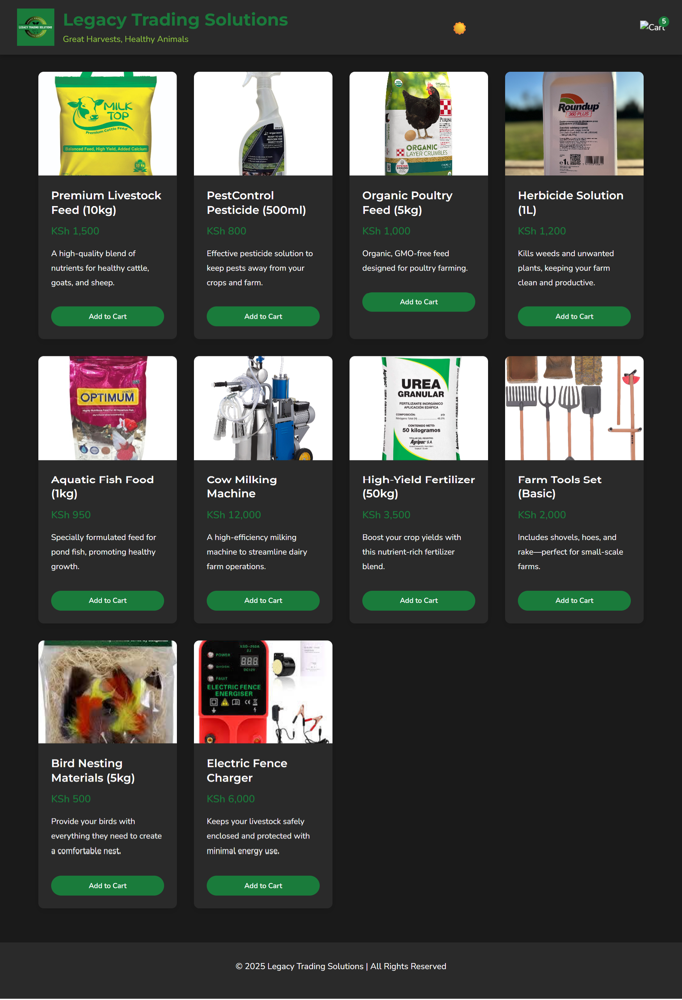

# 🌾 Legacy Product Page – Agrovet Business

A responsive, legacy-style product landing page tailored for a small Agrovet (agricultural + veterinary) business. Built entirely with **HTML**, **CSS**, and **vanilla JavaScript** — no frameworks, no build tools — just raw front-end craftsmanship.

---

## 🔍 Overview

This project showcases a functional product page for a fictional Agrovet business in rural Kenya. It includes:
- 📄 Product listing and detail view
- 🛒 Cart functionality (add/remove items)
- 🔄 Page navigation (index + cart)
- 📱 Responsive design for mobile and desktop
- 💼 Business-ready structure for legacy browsers or low-resource environments

---

## 🖼️ Preview



---

## 🧱 Tech Stack

| Layer        | Tech Used       |
|--------------|------------------|
| Structure    | HTML5            |
| Styling      | CSS3             |
| Logic/DOM    | JavaScript (ES6) |
| Assets       | Images (local)   |

---

## 📂 File Breakdown

| File / Folder         | Purpose                                      |
|-----------------------|----------------------------------------------|
| `index.html`          | Main product landing page                    |
| `cart.html`           | Cart overview + remove/checkout logic        |
| `styles.css`          | Custom layout, colors, media queries         |
| `script.js`           | Core interactivity, cart manipulation        |
| `assets/images/`      | Logo and product visuals                     |

---

## ⚙️ Features

- ✅ Product display with pricing
- ✅ Add-to-cart with item tracking
- ✅ Cart page with dynamic updates
- ✅ Simple, clean UI with mobile support
- ✅ No external dependencies – works offline

---

## 🚀 How to Run Locally

> No setup needed — just clone and open in your browser.

```bash
git clone https://github.com/KiriManii/legacy-product-page.git
cd legacy-product-page
# Open index.html directly in browser
````

> Or drag `index.html` into Chrome, Firefox, or Edge to preview instantly.

---

## 📌 Use Cases

This is ideal for:

* Small-scale local shops wanting a **static catalog + cart**
* Teaching basic front-end logic without React or Vue
* Deploying to Netlify, GitHub Pages, or low-cost hosting

---

## 📈 Future Enhancements (Ideas)

* 🔐 Add localStorage to persist cart between sessions
* 🌍 Translate into Swahili for Kenyan users
* 🧠 Refactor using modular JavaScript or ES6 classes
* 🔗 Connect to a payment processor like Flutterwave or M-PESA
* 🌐 Convert into a PWA (Progressive Web App)

---

## 🙌 Credits

Crafted with passion by [KiriManii](https://github.com/KiriManii)
Inspired by the need for affordable digital tools for African businesses.

---

## 📄 License

This project is open-sourced under the [MIT License](https://choosealicense.com/licenses/mit/).

---
